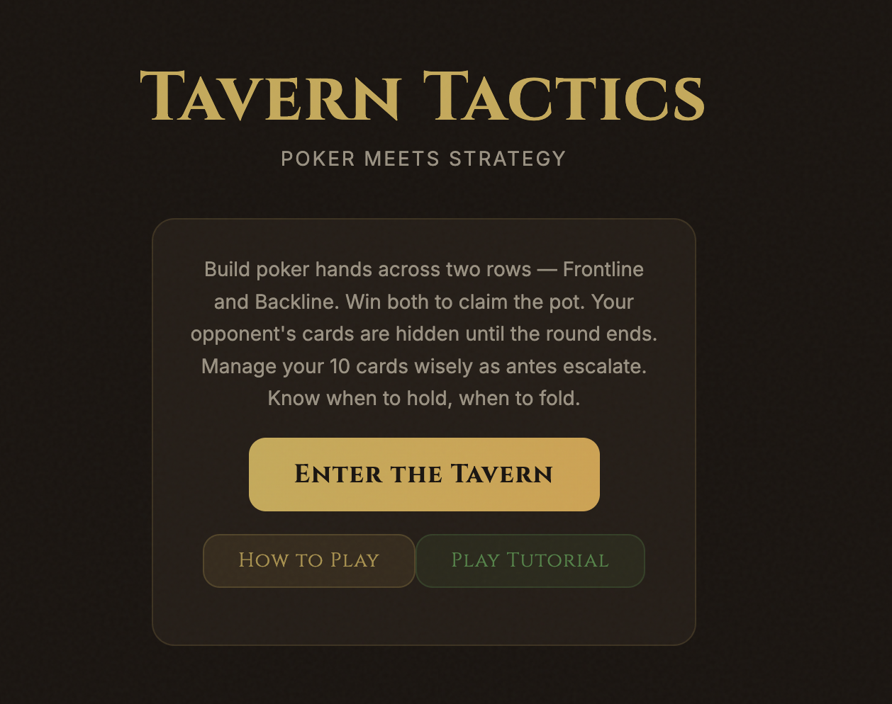

# Tavern Tactics

**Poker meets Gwent in a medieval tavern. Outsmart the house, bluff your way to glory, and don't blow all your chips on round one.**



## What Is This?

Tavern Tactics is a single-player strategy card game where you build poker hands across two rows (Frontline and Backline) while managing a shared chip economy across multiple rounds. Think Texas Hold'em had a baby with The Witcher's Gwent — and they raised it in a dimly lit tavern.

You get 10 cards. They have to last you the whole match. Every card you slam down now is one fewer you'll have later. Choose wisely... or don't. We're not your mom.

## How It Works

- **Best of 3 rounds** — first to win 2 rounds takes the match
- **Two rows per player** — Frontline and Backline. Win BOTH to win the round
- **Hidden cards** — you can't see your opponent's board until the showdown. Bluff accordingly
- **Escalating antes** — 10 / 15 / 20 chips per round. Folding gets expensive fast
- **Face cards have abilities** — Spy, Medic, Commander, Scorcher, and Weather. But here's the twist: you choose whether to activate the ability (card becomes dead weight in your hand) or play it as a high-value poker card (no ability). Big brain decisions only
- **Betting system** — check, bet, raise, call, or fold. Just like poker night, except you won't lose your rent money

## The Face Cards

| Card | Ability | Value |
|------|---------|-------|
| Jack (Spy) | Goes to opponent's board + you draw 2 | 11 |
| Queen (Medic) | Revives best card from graveyard | 12 |
| King (Commander) | Win this row = opponent loses 5 extra chips | 13 |
| Ace (Scorcher) | Destroys opponent's strongest card in row | 14 |
| Joker (Weather) | Disables all flushes for the round | - |

**The catch:** if you use the ability, the card doesn't count toward your poker hand. Choose wisely.

## Tech Stack

- React 19 + TypeScript
- XState 5 (state machine for game flow)
- Tailwind CSS 4 (medieval tavern aesthetic)
- Vite 7

## Run It Locally

```bash
# Clone it
git clone https://github.com/shubhamgoel27/tavern-nights.git
cd tavern-nights

# Install dependencies
npm install

# Fire it up
npm run dev
```

Then open [http://localhost:5173](http://localhost:5173) and enter the tavern.

## Tips For Not Getting Destroyed

1. **Don't dump all your cards in round 1.** Seriously. Save 3-4 for later
2. **Balance both rows.** A killer Frontline means nothing if your Backline is empty
3. **Bluff early, play tight late.** Your opponent can't see your cards — use that
4. **Face card timing matters.** Queens are useless in round 1 (empty graveyard). Aces are best when there's something worth destroying
5. **Know when to fold.** Losing 10 chips is better than losing 30 chasing a bad hand

Press `?` during a game for a quick reference sheet.

---

Built with vibes and too much coffee.
